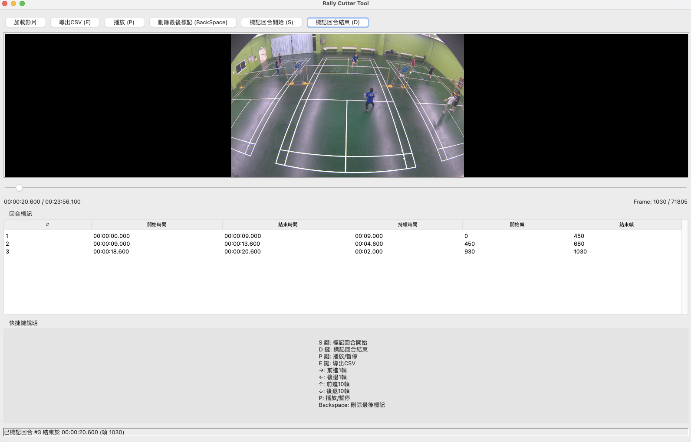

# CutRallies

A simple video tool for marking and cutting rally segments in sports videos.



這個工具包括兩個主要功能：
1. **標記工具 (cut_rallies.py)**: 用於標記影片中的回合時間點
2. **剪輯工具 (video_cutting.py)**: 根據標記檔案自動剪輯影片段落

## 工作流程

1. 使用 `cut_rallies.py` 標記影片中的回合時間段
2. 匯出 rally_labels.csv 檔案
3. 使用 `video_cutting.py` 根據標記檔案剪輯影片段落

## 檔案結構

```
project/
│
├── cut_rallies.py     # 標記工具主程式
├── video_cutting.py   # 剪輯工具主程式
├── processed_videos.json    # 已處理影片的快取紀錄 (自動生成)
├── video_cutting.log    # 剪輯工具運行日誌 (自動生成)
│
├── 輸入資料夾/    # 存放原始影片的目錄
│   ├── 比賽1/    # 每場比賽的目錄
│   │   ├── 1.mp4    # 視角1的影片
│   │   ├── 2.mp4    # 視角2的影片
│   │   └── rally_labels.csv    # 回合標記檔案 (由 cut_rallies.py 生成)
│   └── 比賽2/
│       ├── ...
│
└── 輸出資料夾/    # 存放剪輯後影片的目錄
    ├── rally1/    # 第1回合的所有視角
    │   ├── view1/    # 視角1的剪輯
    │   └── view2/    # 視角2的剪輯
    └── rally2/
        ├── ...
```

## 第一步：使用標記工具 (cut_rallies.py)

### 安裝必要套件

```bash
pip install opencv-python pillow numpy
```

### 使用方法

```bash
python cut_rallies.py
```

### 基本控制

- **Load Video**: 選擇要分析的影片檔
- **Play/Pause (P)**: 播放/暫停影片
- **Mark Rally Start (S)**: 標記回合開始點
- **Mark Rally End (D)**: 標記回合結束點
- **Delete Last Mark (Backspace)**: 刪除最後一個標記
- **Export CSV (E)**: 將所有標記儲存為 CSV 檔案

### 鍵盤快捷鍵

- **S**: 標記回合開始
- **D**: 標記回合結束
- **P**: 播放/暫停影片
- **E**: 匯出 CSV
- **→**: 前進 1 影格
- **←**: 後退 1 影格
- **↑**: 前進 10 影格
- **↓**: 後退 10 影格
- **Backspace**: 刪除最後一個標記

### 輸出 rally_labels.csv 格式

```
Rally Number,Start Time,End Time,Start Frame,End Frame
1,00:05:20,00:05:45,9600,10350
2,00:08:30,00:09:15,15300,16650
...
```

包含以下資訊：
- Rally Number: 回合編號
- Start/End Time: 開始/結束時間 (HH:MM:SS.mmm)
- Start/End Frame: 開始/結束影格數

## 第二步：使用剪輯工具 (video_cutting.py)

### 安裝必要套件

```bash
pip install pandas
```

確保系統已安裝 ffmpeg。

### 基本使用

```bash
python video_cutting.py --base_dir 輸入資料夾 --output_dir 輸出資料夾
```

### 進階選項

```bash
python video_cutting.py --base_dir 輸入資料夾 --output_dir 輸出資料夾 --workers 8 --cache_file 我的快取.json
```

參數說明：
- `--base_dir`：原始影片目錄
- `--output_dir`：剪輯後影片的存放目錄
- `--workers`：同時處理的工作數量（預設：CPU 核心數）
- `--cache_file`：已處理影片的快取紀錄檔案（預設：processed_videos.json）

## 注意事項

1. 輸入目錄必須包含 mp4 影片檔和 rally_labels.csv 檔案
2. 影片檔名應為數字（如 1.mp4, 2.mp4）代表不同視角
3. 程式會自動跳過已處理的影片段落，加快再次執行的速度

## 疑難排解

若您在影片播放時遇到問題：
1. 確保已安裝正確的影片編碼器
2. 嘗試將影片轉換為 MP4 格式
3. 檢查終端機輸出中的錯誤訊息